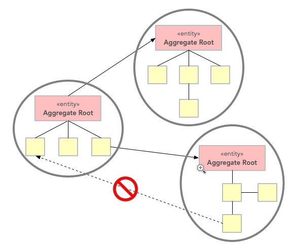
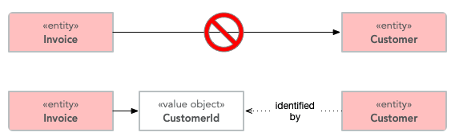

# Model-Driven Design In A Nutshell

# Table of Contents

___

1. [Model-Driven Design](#model-driven-design)
    1. [Layered Architecture](#layered-architecture)
    2. [Entities](#entities)
    3. [Value Objects](#value-objects)
    4. [Services](#services)
    5. [Modules](#modules)
    6. [Aggregates](#aggregates)
    7. [Factories](#factories)
    8. [Repositories](#repositories)

2. [Refactoring Toward Deeper Insight](#fourth-examplehttpwwwfourthexamplecom)
3. [Preserving Model Integrity](#fourth-examplehttpwwwfourthexamplecom)

## 1. Model-Driven Design


### i. Layered Architecture


### ii. Entities

Entity là mutable \
Mỗi entity có một ID duy nhất được chỉ định khi được tạo ra và không thay đổi trong suốt vòng đời của nó. \
Mô hình hóa tất cả các method thay đổi state của entity dưới dạng các động từ thể hiện bussiness logic.

```java
/// Hợp đồng lao động có thể kết thúc vì ban đầu chúng chỉ là tạm thời,
// do chuyển nội bộ từ chi nhánh công ty này sang chi nhánh công ty khác,
// do nhân viên nghỉ việc hoặc do người sử dụng lao động sa thải nhân viên
class Employee {
    String endDate;
   
   ❌

    setEndDate(finalDay);
   
   ✅

    terminateContract(reason, finalDay);
}
```

Một Entity tiêu chuẩn:

```java
public class Person {

    private final PersonId personId;
    private final EventLog changeLog;

    private PersonName name;
    private LocalDate birthDate;
    private StreetAddress address;
    private EmailAddress email;
    private PhoneNumber phoneNumber;

    public Person(PersonId personId, PersonName name) {
        this.personId = Objects.requireNonNull(personId);
        this.changeLog = new EventLog();
        changeName(name, "initial name");
    }

    public void changeName(PersonName name, String reason) {
        Objects.requireNonNull(name);
        this.name = name;
        this.changeLog.register(new NameChangeEvent(name), reason);
    }

    public Stream<PersonName> getNameHistory() {
        return this.changeLog.eventsOfType(NameChangeEvent.class).map(NameChangeEvent::getNewName);
    }

    // Other getters omitted

    public boolean equals(Object o) {
        if (o == this) {
            return true;
        }
        if (o == null || o.getClass() != getClass()) {
            return false;
        }
        return personId.equals(((Person) o).personId);
    }

    public int hashCode() {
        return personId.hashCode();
    }
}
```

- PersonId là entity ID. Có thể sử dụng UUID, String hoặc Long nhưng sử dụng value object sẽ nói lên bản thân nó là một
  ID định danh cho một Person nhất định.
- Sử dụng nhiều value objects nhất có thể: *PersonName*, *LocalDate* (standard Java
  API), *StreetAddress*, *EmailAddress* and *PhoneNumber*.
- Thể hiện bussiness logic bằng cách sử dụng method lưu lại thay đổi property *name* trong *event log* cùng với lý
  do *name* bị đổi.
- Getter lấy ra lịch sử thay đổi tên.
- equals and hashCode chỉ check entity ID.

### iii. Value Objects

❓ Một value object là một đối tượng chứa value. Nếu hai value object có cùng giá trị các properties được coi là một.
. Đối với các value object phức tạp, hãy sử dụng `Builder Pattern`.

- Immutable, shareable, thin & simple.
- Thread safe, xử lý concurrency
- Cho phép entity tập trung trung vào định danh, chuyển trách nhiệm thực hiện business logic cho value object.

✅

- Tên của value object đại diện cho các business logic.
- Triển khai Value Objects đơn giản bằng `Hibernate's UserType, @TypeDef` hoặc `Attribute Converter`
- Triển khai Value Objects phức tạp bằng `@Embeddables`

❌

- Value object không phải DTO , DTO là kỹ thuật truyền dữ liệu,
- Không thay đổi trạng thái của value object mà nên tạo ra 1 instance mới.


### iv. Aggregates

❓ Aggreate là một nhóm các entities và value objects có liên quan chặt chẽ với nhau


- Aggreate luôn luôn có trạng thái nhất quán
- Đảm bảo tính toàn vẹn của business rule và dữ liệu.
- Tăng performance: mặc dù sử dụng lazy fetch có thể tốt hơn eager fetch, nhưng context of data access luôn được duy trì
  cũng ảnh hưởng đến performance. Vì vậy một aggregate NHỎ khi tiếp tục load relationship sẽ không bị phình to.

✅

- Giữ cho aggregate nhỏ
- Chọn một entity làm gốc của aggregate và kiểm soát tất cả quyền truy cập vào các đối tượng bên trong boundary
  thông qua root.
- Chỉ cho phép các đối tượng bên ngoài tham chiếu đến root.
- Các tham chiếu tạm thời đến các entity nội bộ có thể được sử dụng chỉ trong một thao tác.
- Aggreate root chịu trách nhiệm thực thi các thay đổi trạng thái lên các entity, object value bên trong.





```java

@Entity
public class Invoice extends BaseAggregateRoot<InvoiceId> { // <1>

    @OneToMany(cascade = CascadeType.ALL, orphanRemoval = true)
    private Set<InvoiceItem> items; // <2>

    // The rest of the methods and fields are omitted
}
```

### v. Services

❓ Thuộc về domain, có hành vi tham chiếu đến các đối tượng khác trong miền, bản thân không có trạng thái.

✅ Thể hiện nghiệp vụ chứa tương tác giữa các aggregate với nhau.

### vi. Modules

✅

```
foo.bar.domain.model.authentication
    AuthenticationService
foo.bar.domain.model.user
    User
    UserRepository
    UserId
    UserName
    PasswordEncoder
foo.bar.domain.model.role
    Role
    RoleRepository
    RoleId
```

❌

```
foo.bar.domain.model.services
    AuthenticationService
    PasswordEncoder
foo.bar.domain.model.repositories
    UserRepository
    RoleRepository
foo.bar.domain.model.entities
    User
    Role
foo.bar.domain.model.valueobjects
    UserId
    RoleId
    UserName
```

### vii. Factories


❓ Khi các entity và aggregate quá phức tạo để tạo một instance thông qua constructor thì cần sử dụng factory pattern.

✅ Đóng gói logic nghiệp vụ nằm trong lớp domain.

### viii. Repositories

❌ Sử dụng repository nhằm gói gọn tất cả logic cần thiết để lấy các reference đến các domain object.
Các domain object sẽ không phải xử lý logic infrastructure mà sẽ chỉ lấy chúng từ repository và model sẽ đạt được sự rõ
ràng và tập trung vào nghiệp vụ.

✅ 
- Để viết các sql phức tạp, sử dụng `Specifications` hoặc `QueryDSL`

Sử dụng kết hợp Factory và Repository


___

## References

Eric Evans. Domain-Driven Design (08-2003). \
Petter Holmstöm. Domain-Driven Design Series' Articles (04-2021).