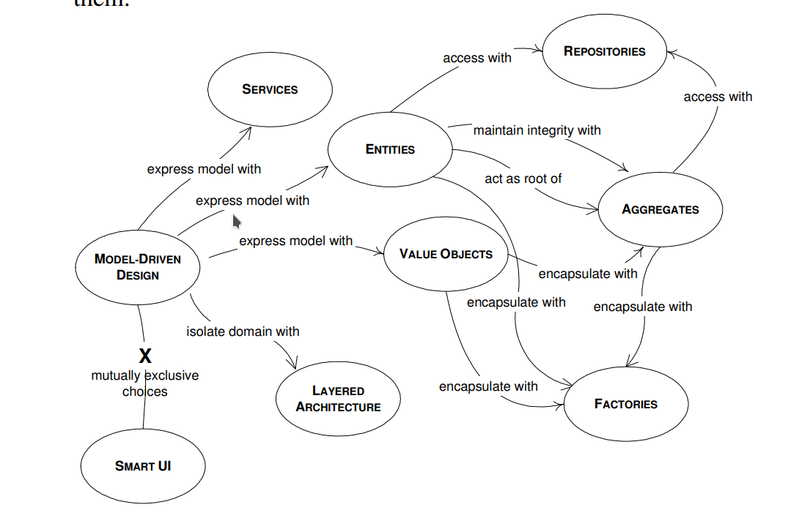
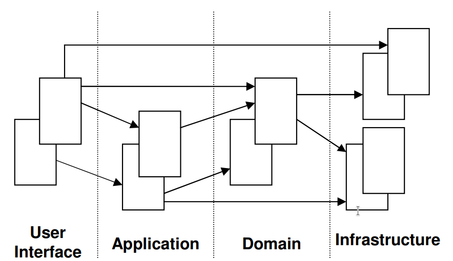
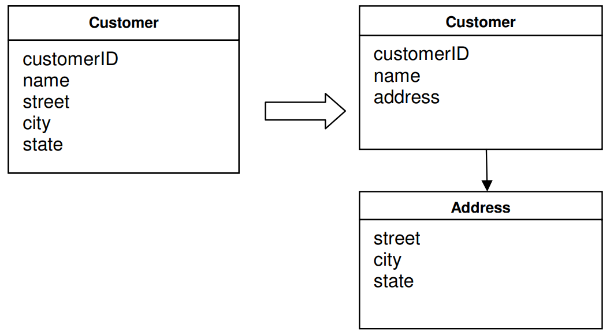
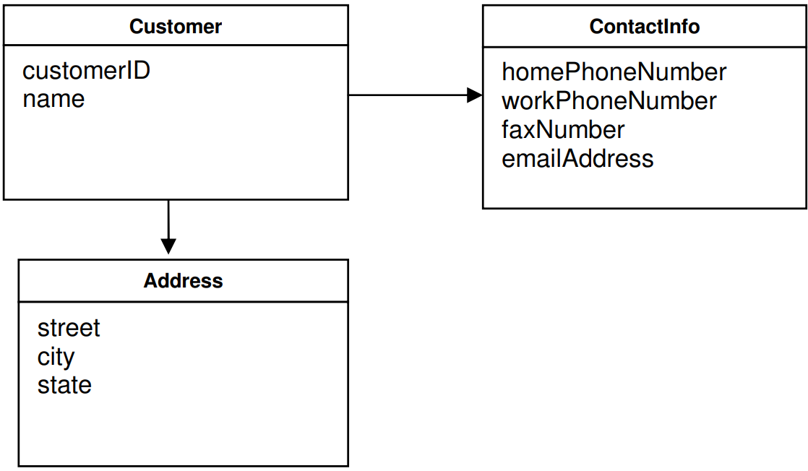
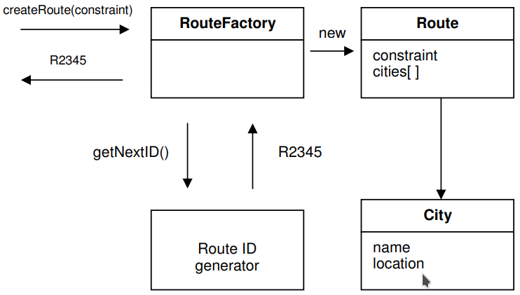
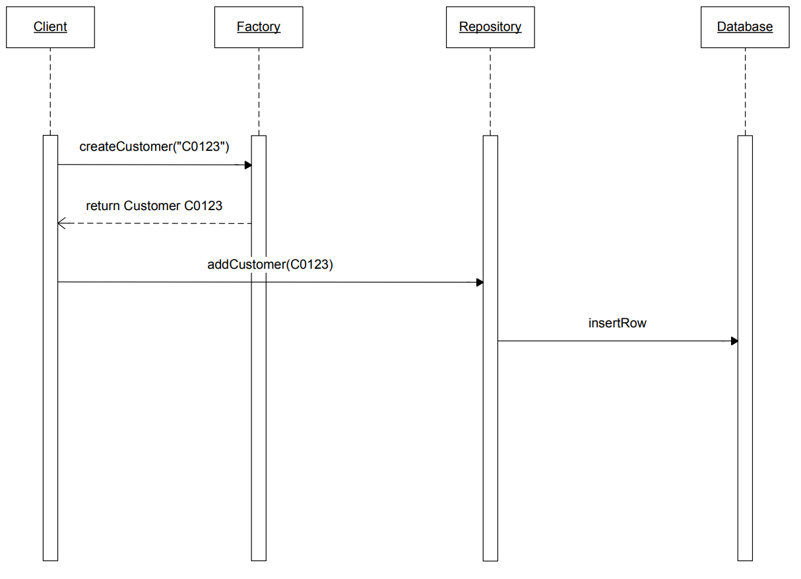

# Model-Driven Design In A Nutshell

# Table of Contents

___

1. [Model-Driven Design](#model-driven-design)
    1. [Layered Architecture](#layered-architecture)
    2. [Entities](#entities)
    3. [Value Objects](#value-objects)
    4. [Services](#services)
    5. [Modules](#modules)
    6. [Aggregates](#aggregates)
    7. [Factories](#factories)
    8. [Repositories](#repositories)

2. [Refactoring Toward Deeper Insight](#fourth-examplehttpwwwfourthexamplecom)
3. [Preserving Model Integrity](#fourth-examplehttpwwwfourthexamplecom)

## 1. Model-Driven Design



### i. Layered Architecture



### ii. Entities

Entity là mutable \
Mỗi entity có một ID duy nhất được chỉ định khi được tạo ra và không thay đổi trong suốt vòng đời của nó. \
Mô hình hóa tất cả các method thay đổi state của entity dưới dạng các động từ thể hiện bussiness logic.

```java
/// Hợp đồng lao động có thể kết thúc vì ban đầu chúng chỉ là tạm thời,
// do chuyển nội bộ từ chi nhánh công ty này sang chi nhánh công ty khác,
// do nhân viên nghỉ việc hoặc do người sử dụng lao động sa thải nhân viên
class Employee {
    String endDate;
   
   ❌

    setEndDate(finalDay);
   
   ✅

    terminateContract(reason, finalDay);
}
```

Một Entity tiêu chuẩn:

```java
public class Person {

    private final PersonId personId;
    private final EventLog changeLog;

    private PersonName name;
    private LocalDate birthDate;
    private StreetAddress address;
    private EmailAddress email;
    private PhoneNumber phoneNumber;

    public Person(PersonId personId, PersonName name) {
        this.personId = Objects.requireNonNull(personId);
        this.changeLog = new EventLog();
        changeName(name, "initial name");
    }

    public void changeName(PersonName name, String reason) {
        Objects.requireNonNull(name);
        this.name = name;
        this.changeLog.register(new NameChangeEvent(name), reason);
    }

    public Stream<PersonName> getNameHistory() {
        return this.changeLog.eventsOfType(NameChangeEvent.class).map(NameChangeEvent::getNewName);
    }

    // Other getters omitted

    public boolean equals(Object o) {
        if (o == this) {
            return true;
        }
        if (o == null || o.getClass() != getClass()) {
            return false;
        }
        return personId.equals(((Person) o).personId);
    }

    public int hashCode() {
        return personId.hashCode();
    }
}
```

- PersonId là entity ID. Có thể sử dụng UUID, String hoặc Long nhưng sử dụng value object sẽ nói lên bản thân nó là một
  ID định danh cho một Person nhất định.
- Sử dụng nhiều value objects nhất có thể: `PersonName`, `LocalDate` (standard Java
  API), `StreetAddress`, `EmailAddress` and `PhoneNumber`.
- Thể hiện bussiness logic bằng cách sử dụng method lưu lại thay đổi property `name` trong `event log` cùng với lý
  do `name` bị đổi.
- Getter lấy ra lịch sử thay đổi tên.
- equals and hashCode chỉ check entity ID.

### iii. Value Objects



### iv. Services

### v. Modules

### vi. Aggregates



### vii. Factories



KHÔNG CẦN đến Factory khi chỉ cần một constructor đơn giản là đủ và NGƯỢC LẠI. Sử dụng constructor khi:

- Constructor đơn giản.
- Việc tạo một object không liên quan đến việc tạo các object khác và tất cả các attributes cần thiết đều được truyền
  qua constructor.

### viii. Repositories

Sử dụng kết hợp Factory và Repository

